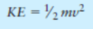

<h2 id="51"> 51. Rate of Inflation  </h2>

The annual rate of inflation is the rate at which money loses its value. For example, if the annual rate of inflation is 3.0%, then in one year it will cost $1030 to buy the goods that could have been purchased for $1000 today. Put another way, a year from now $1000 will only buy 1/1.03 * $1000, or $970.87, worth of goods. Two years from now $1000 will only buy only 1/1.03 of $970.87, or $942.59 worth of goods. Write a program that allows the user to enter an annual rate of inflation and then reports how much $1000 today will be worth each year for the next 10 years.

Input validation: Do not accept an inflation rate less than 1% or greater than 15%.

- [ ] Answer in C++
- [ ] Answer in Java

<h2 id="52"> 52.  Population </h2>

Write a program that will predict the size of a population of organisms. The program should ask the user for the starting number of organisms, their average daily population increase (as a percentage of current population), and the number of days they will multiply. A loop should display the size of the population for each day.

Input Validation: Do not accept a number less than two for the starting size of the population. Do not accept a negative number for average daily population increase. Do not accept a number less than one for the number of days they will multiply.

- [ ] Answer in C++
- [ ] Answer in Java

<h2 id="53"> 53. Markup </h2>

Write a program that asks the user to enter an item’s wholesale cost and its markup percentage. It should then display the item’s retail price. For example: • If an item’s wholesale cost is 5.00 and its markup percentage is 100%, then the item’s retail price is 10.00. • If an item’s wholesale cost is 5.00 and its markup percentage is 50%, then the item’s retail price is 7.50. The program should have a function named calculate Retail that receives the wholesale cost and the markup percentage as arguments, and returns the retail price of the item.

Input Validation: Do not accept negative values for either the wholesale cost of the item or the percent markup.

- [ ] Answer in C++
- [ ] Answer in Java

<h2 id="54"> 54.  Celsius Temperature Table </h2>

The formula for converting a temperature from Fahrenheit to Celsius is

where F is the Fahrenheit temperature and C is the Celsius temperature. Write a function named celsius that accepts a Fahrenheit temperature as an argument. The function should return the temperature, converted to Celsius. Demonstrate the function by calling it in a loop that displays a table of the Fahrenheit temperatures 0 through 20 and their Celsius equivalents.

- [ ] Answer in C++
- [ ] Answer in Java

<h2 id="55"> 55.  Falling Distance </h2>

The following formula can be used to determine the distance an object falls due to gravity in a specific time period:

The variables in the formula are as follows: d is the distance in meters, g is 9.8, and t is the time in seconds that the object has been falling. Write a function named fallingDistance that accepts an object’s falling time (in seconds) as an argument. The function should return the distance, in meters, that the object has fallen during that time interval. Write a program that demonstrates the function by calling it in a loop that passes the values 1 through 10 as arguments, and displays the return value.

- [ ] Answer in C++
- [ ] Answer in Java

<h2 id="56"> 56.  Kinetic Energy</h2>

In physics, an object that is in motion is said to have kinetic energy. The following formula can be used to determine a moving object’s kinetic energy:

The variables in the formula are as follows: KE is the kinetic energy in joules, m is the object’s mass in kilograms, and v is the object’s velocity in meters per second. Write a function named kineticEnergy that accepts an object’s mass (in kilograms) and velocity (in meters per second) as arguments. The function should return the amount of kinetic energy that the object has. Demonstrate the function by calling it in a program that asks the user to enter values for mass and velocity.

- [ ] Answer in C++
- [ ] Answer in Java

<h2 id="57"> 57. Winning Division </h2>

Write a program that determines which of a company’s four divisions (Northeast, Southeast, Northwest, and Southwest) had the greatest sales for a quarter. It should include the following two functions, which are called by main. 

- double getSales() is passed the name of a division. It asks the user for a division’s quarterly sales figure, validates the input, then returns it. It should be called once for each division. 
- void findHighest() is passed the four sales totals. It determines which is the largest and prints the name of the high grossing division, along with its sales figure. Input Validation: Do not accept dollar amounts less than $0.00.

- [ ] Answer in C++
- [ ] Answer in Java

<h2 id="58"> 58. Safest Driving Area </h2>

Write a program that determines which of 5 geographic regions within a major city (north, south, east, west, and central) had the fewest reported traffic accidents last year. It should have the following two functions, which are called by main. 

- int getNumAccidents() is passed the name of a region. It asks the user for the number of traffic accidents reported in that region during the last year, validates the input, then returns it. It should be called once for each city region. 
- void findLowest() is passed the five accident totals. It determines which is the smallest and prints the name of the region, along with its accident figure. Input Validation: Do not accept an accident number that is less than 0. Lowest Score Drop 
- Write a program that calculates the average of a group of test scores, where the lowest score in the group is dropped. It should use the following functions: 
- void getScore() should ask the user for a test score, store it in a reference parameter variable, and validate it. This function should be called by main once for each of the five scores to be entered. 
- void calcAverage() should calculate and display the average of the four highest scores. This function should be called just once by main, and should be passed the five scores. 
- int findLowest() should find and return the lowest of the five scores passed to it. It should be called by calcAverage, which uses the function to determine one of the five scores to drop. Input Validation: Do not accept test scores lower than 0 or higher than 100.

- [ ] Answer in C++
- [ ] Answer in Java

<h2 id="59"> 59.  Star Search </h2>

A particular talent competition has 5 judges, each of whom awards a score between 0 and 10 to each performer. Fractional scores, such as 8.3, are allowed. A performer’s final score is determined by dropping the highest and lowest score received, then averaging the 3 remaining scores. 

Write a program that uses these rules to calculate and display a contestant’s score. It should include the following functions: 

- void getJudgeData() should ask the user for a judge’s score, store it in a reference parameter variable, and validate it. This function should be called by main once for each of the 5 judges.
- double calcScore() should calculate and return the average of the 3 scores that remain after dropping the highest and lowest scores the performer received. This function should be called just once by main, and should be passed the 5 scores. The last two functions, described below, should be called by calcScore, which uses the returned information to determine which of the scores to drop. 
- int findLowest() should find and return the lowest of the 5 scores passed to it. 
- int findHighest() should find and return the highest of the 5 scores passed to it. Input Validation: Do not accept judge scores lower than 0 or higher than 10.

- [ ] Answer in C++
- [ ] Answer in Java

<h2 id="60"> 60. Order Status </h2>

The Middletown Wholesale Copper Wire Company sells spools of copper wiring for $100 each and ships them for $10 apiece. Write a program that displays the status of an order. It should use two functions. The first function asks for the following data and stores the input values in reference parameters. 

- The number of spools ordered.
- The number of spools in stock. 
- Any special shipping and handling charges (above the regular $10 rate). The second function receives as arguments any values needed to compute and display the following information: 
- The number of ordered spools ready to ship from current stock. 
- The number of ordered spools on backorder (if the number ordered is greater than what is in stock). 
- Total selling price of the portion ready to ship (the number of spools ready to ship times $100). 
- Total shipping and handling charges on the portion ready to ship. 
- Total of the order ready to ship. The shipping and handling parameter in the second function should have the default argument 10.00. Input Validation: Do not accept numbers less than 1 for spools ordered. Do not accept a number less than 0 for spools in stock or for shipping and handling charges.

- [ ] Answer in C++
- [ ] Answer in Jav
