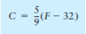
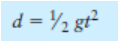

<h2 id="51"> 51. Rate of Inflation  </h2>

The annual rate of inflation is the rate at which money loses its value. For example, if the annual rate of inflation is 3.0%, then in one year it will cost $1030 to buy the goods that could have been purchased for $1000 today. Put another way, a year from now $1000 will only buy 1/1.03 * $1000, or $970.87, worth of goods. Two years from now $1000 will only buy only 1/1.03 of $970.87, or $942.59 worth of goods. Write a program that allows the user to enter an annual rate of inflation and then reports how much $1000 today will be worth each year for the next 10 years.

Input validation: Do not accept an inflation rate less than 1% or greater than 15%.

- [ ] Answer in C++
- [ ] Answer in Java

<h2 id="52"> 52.  Population </h2>

Write a program that will predict the size of a population of organisms. The program should ask the user for the starting number of organisms, their average daily population increase (as a percentage of current population), and the number of days they will multiply. A loop should display the size of the population for each day.

Input Validation: Do not accept a number less than two for the starting size of the population. Do not accept a negative number for average daily population increase. Do not accept a number less than one for the number of days they will multiply.

- [ ] Answer in C++
- [ ] Answer in Java

<h2 id="53"> 53. Markup </h2>

Write a program that asks the user to enter an item’s wholesale cost and its markup percentage. It should then display the item’s retail price. For example: • If an item’s wholesale cost is 5.00 and its markup percentage is 100%, then the item’s retail price is 10.00. • If an item’s wholesale cost is 5.00 and its markup percentage is 50%, then the item’s retail price is 7.50. The program should have a function named calculate Retail that receives the wholesale cost and the markup percentage as arguments, and returns the retail price of the item.

Input Validation: Do not accept negative values for either the wholesale cost of the item or the percent markup.

- [ ] Answer in C++
- [ ] Answer in Java

<h2 id="54"> 54.  Celsius Temperature Table </h2>

The formula for converting a temperature from Fahrenheit to Celsius is

where F is the Fahrenheit temperature and C is the Celsius temperature. Write a function named celsius that accepts a Fahrenheit temperature as an argument. The function should return the temperature, converted to Celsius. Demonstrate the function by calling it in a loop that displays a table of the Fahrenheit temperatures 0 through 20 and their Celsius equivalents.

- [ ] Answer in C++
- [ ] Answer in Java

<h2 id="55"> 55.  Falling Distance </h2>

The following formula can be used to determine the distance an object falls due to gravity in a specific time period:

The variables in the formula are as follows: d is the distance in meters, g is 9.8, and t is the time in seconds that the object has been falling. Write a function named fallingDistance that accepts an object’s falling time (in seconds) as an argument. The function should return the distance, in meters, that the object has fallen during that time interval. Write a program that demonstrates the function by calling it in a loop that passes the values 1 through 10 as arguments, and displays the return value.

- [ ] Answer in C++
- [ ] Answer in Java

<h2 id="56"> 56.  Membership Fees Increase</h2>

- [ ] Answer in C++
- [ ] Answer in Java

<h2 id="57"> 57. Random Number Guessing Game </h2>

- [ ] Answer in C++
- [ ] Answer in Java

<h2 id="58"> 58. Random Number Guessing Game Enhancement</h2>

- [ ] Answer in C++
- [ ] Answer in Java

<h2 id="59"> 59.  The Greatest and Least of These </h2>

- [ ] Answer in C++
- [ ] Answer in Java

<h2 id="60"> 60. Student Line Up </h2>

- [ ] Answer in C++
- [ ] Answer in Jav
